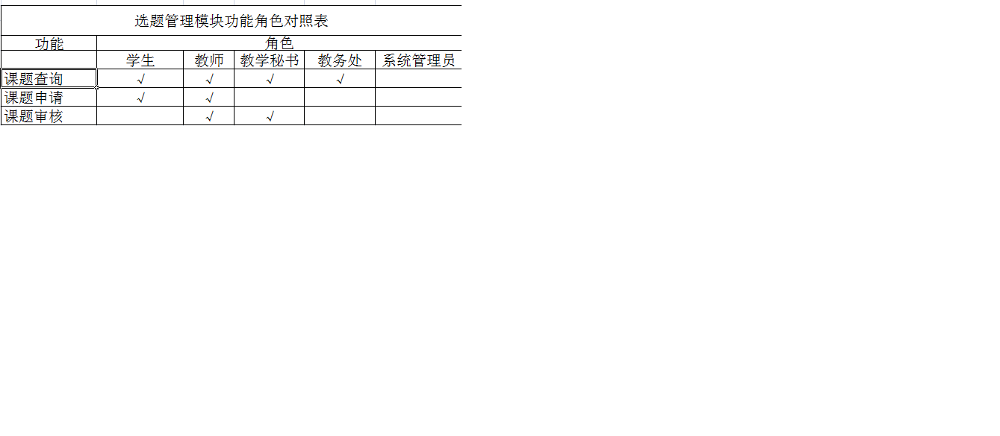

# 注意

本仓库文件均为手动创建，直接导入IDE等可能存在目录结构等问题，建议clone或download后手动建立工程。若其中碰到问题，请与我联系。

# bysj项目描述

项目为LeeZhou个人的毕业设计作品。

# 标题
基于SSM框架的高校毕业设计管理系统的设计与开发

# 关键字
Spring;MyBatis;pringMVC;EasyUI;毕业设计管理;MySQL;JSP;Java

# 摘要

毕业设计是高校培养方案中的重要实践环节，是对学生学习成果的全面性、综合性考核，整个流程周期长，工作量大。传统的毕业设计管理工作以人工为主，工作流程复杂、效率低，易出错。随着网络信息化的推进与高校教育教学的改革创新，毕业设计管理的工作方式同样需要与时俱进。因此设计开发出一套适用于普通高校的毕业设计管理系统很有必要性。

本课题针对目前高校毕业设计管理工作的现状，基于B/S架构，使用Java、JSP、MySQL等开发语言与技术，设计开发出一套高效、实用的高校毕业设计管理系统。系统包含学生、教师、教学秘书、教务处、系统管理员5类角色，系统划分为基本信息管理模块、选题管理模块、文档管理模块、答辩管理模块，权限管理模块，所有模块确保能完成毕业设计管理工作流程。

# 如何使用？

如何使用这个项目，或者学习其中的资料呢?

第一种方式，也是最简洁的方式。直接下载projectReleasePackage中的war包，sql脚本文件，在你的web服务器上热部署。注意阅读doc文件夹中的相关文档。

第二种方式，如果您想学习这个项目或者同样作为你研究的一部分，你可以clone或download src源文件，进行源码级的学习,同样，请注意阅读doc中的相关文档。

# 待改进

由于时间和个人能力等因素，实际工程和预期设计文档有大约10%的偏差。release版本是基于测试版本的完整打包，已经修复了常见的bug。

目前已知的待改进的部分有：  1) 由于系统采用了easy-ui进行前端设计，前端用户交互需要进行优化; 2) 文档功能区，在线预览功能受服务器带宽等因素影响，加载性能需要优化。

# 项目截图
**1.学生首页**

**2.基本信息管理**

**3.选题管理**

**4.文档管理**

**5.答辩管理**

**6.在线预览**

**7.授权管理**

