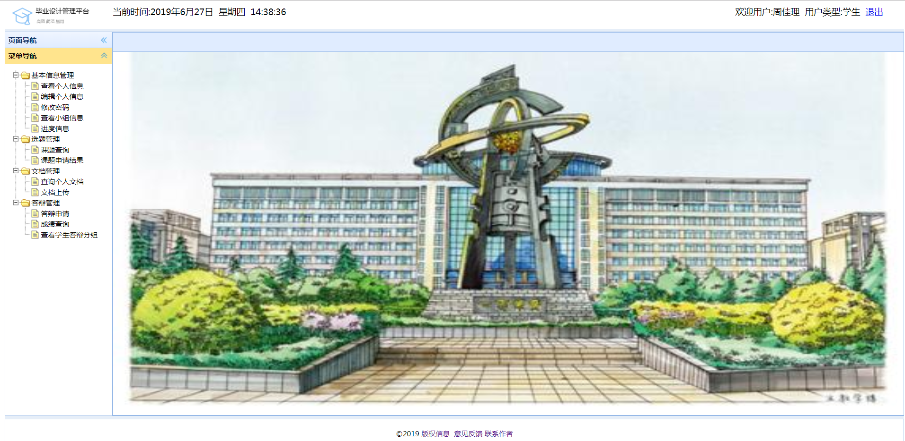
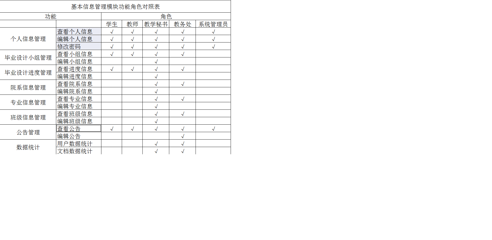
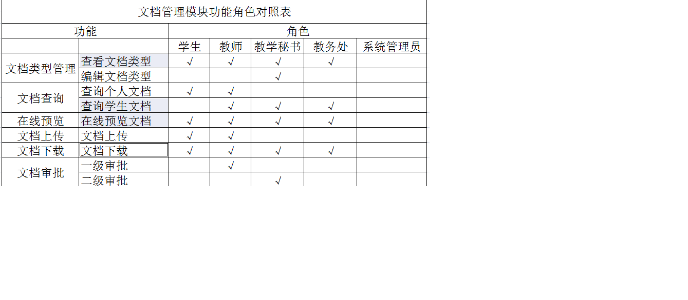
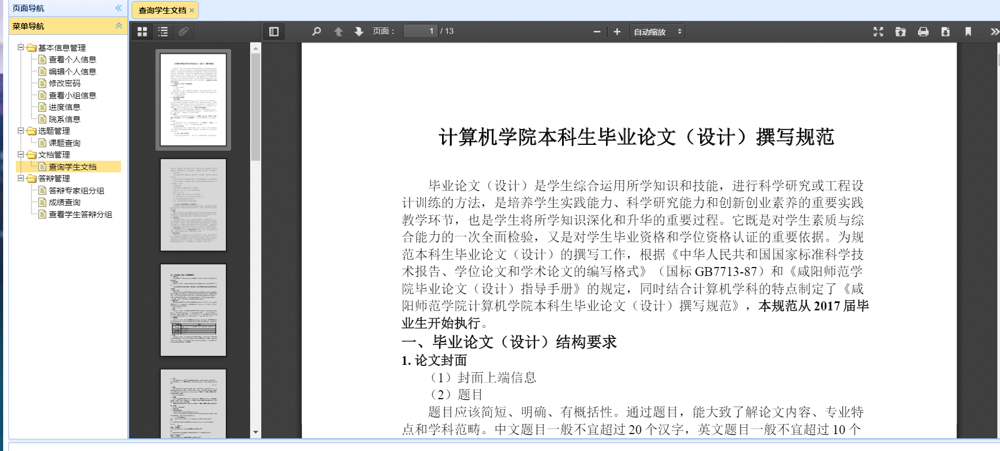

# ATTENTION

The file structure in this warehouse is manually created, does not contain. git files, and can not be imported directly into IDE. Please manually import subfolders and files under SRC and WebContect after downloading.

Contact me if you have problems deploying this project.

# bysj repository description
This project is Leezhou's personal graduation project who was majored in software engineering in the past four years.
# Title
The Design and Implementation of Graduation Project 
Management System Based on SSM Framework
# Keywords
Spring;MyBatis;pringMVC;EasyUI;Graduation Project Management;MySQL;JSP;Java
# Abstract

Graduation project is an important segment in university syllabus. It is a comprehensive assessment of what students have learned in four years. For the duration of the process，it is a mammoth task. The traditional management work of graduation project is mainly manual, with complex work flow, low efficiency and easy to make mistakes. With the advancement of network informatization and the reform and innovation of college education and teaching, it is urgent to advance with the times. Therefore, it is essential to devise and program a graduation thesis administrative applicatoin suitable for ordinary universities.

This project aims at the current status of the management of university graduation project, based on B/S architecture, using Java, JSP, MySQL and other development language and technology, design and development a high efficient and available university graduation project management system. The system includes five roles of senior, tutor, teaching secretaries, dean's office and appliction keepers. The thesis is decollate into basic information management module, topic selection management module, document management module, reply management module and authority management module. All modules guarantee that the educational staffwork can be completed.

# How to use

How to use the project or learn the literature?

The first and most convenient way is to download WAR files and SQL scripts directly and deploy them on your servers, such as Tomcat and mySQL. WYSIWYG.

The second way, namely personal learning, research, secondary development, can download or clone the entire BYSJ repository, import SRC and WebContent into IDE, compile. The whole BYSJ library contains SRC (Java source files), WebContent (front-end page files Html, Jsp, CSS and some JavaScript script files), doc (description documents, user manuals, design documents, design vector schema), Project Release Package (project release package, including WAR files, SQL script files).

# TODO

Due to time, about 10% of project and design documents come in and out, which is reflected in user interaction and functional performance optimization. 

At present, there are known as:  1) front-end CSS adaptation problem; 2) the "online preview function" of the "document" functional area is not good enough.

# PrtSc
**1.学生首页**

**2.基本信息管理**

**3.选题管理**

**4.文档管理**

**5.答辩管理**

**6.在线预览**

**7.授权管理**

